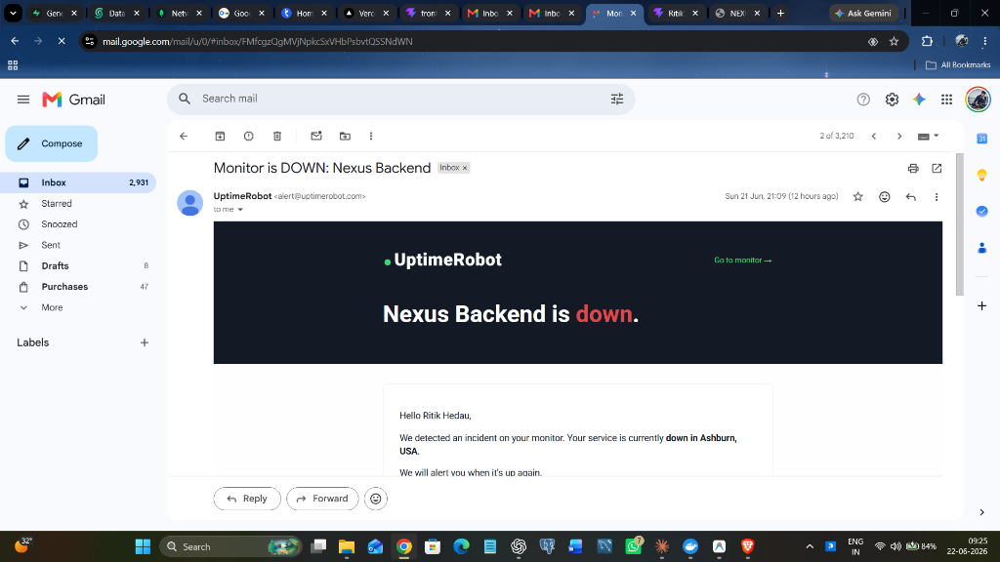
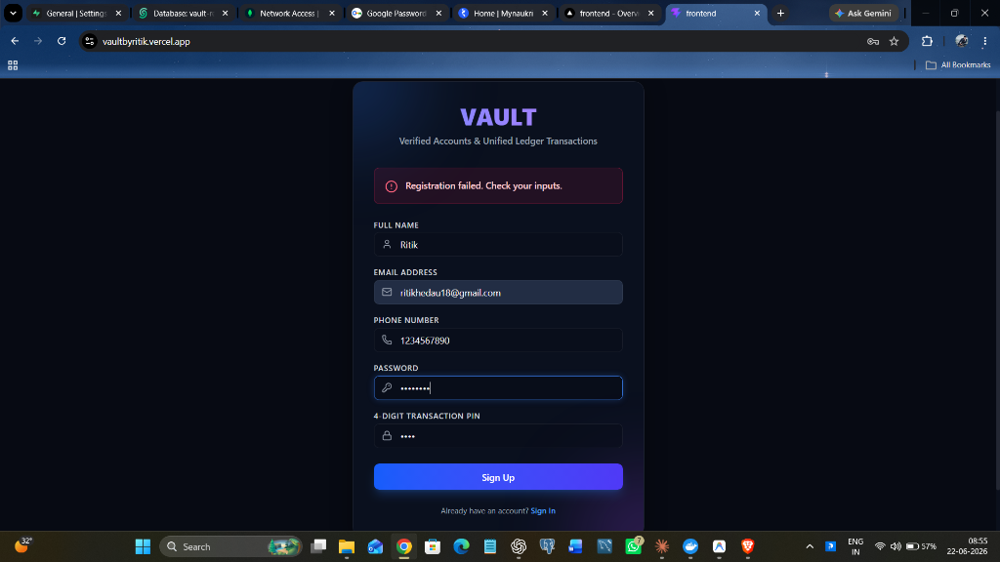
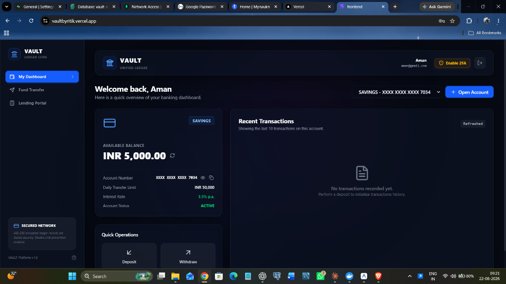
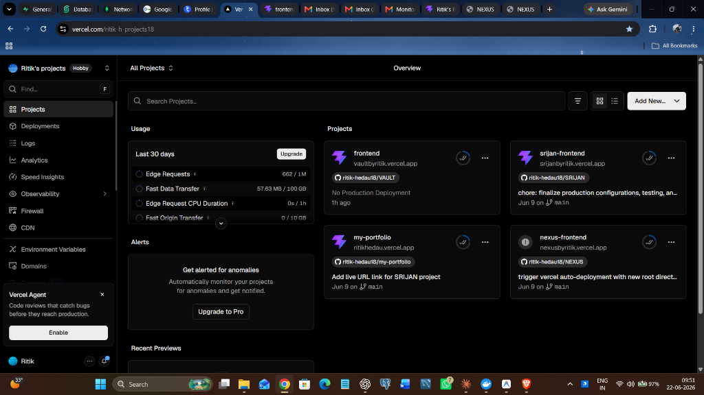
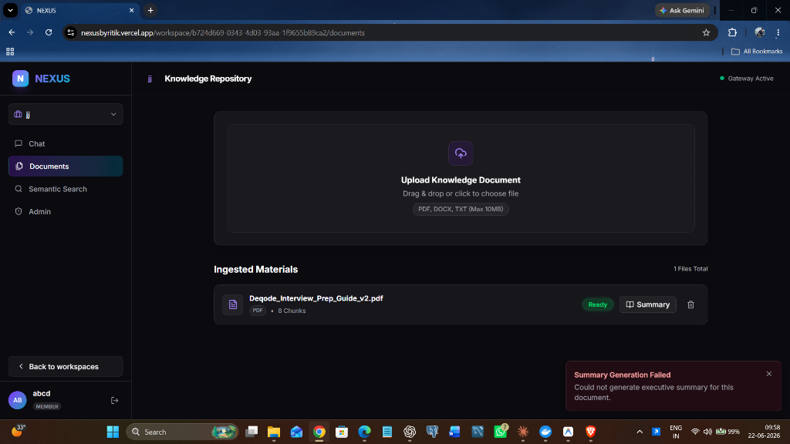
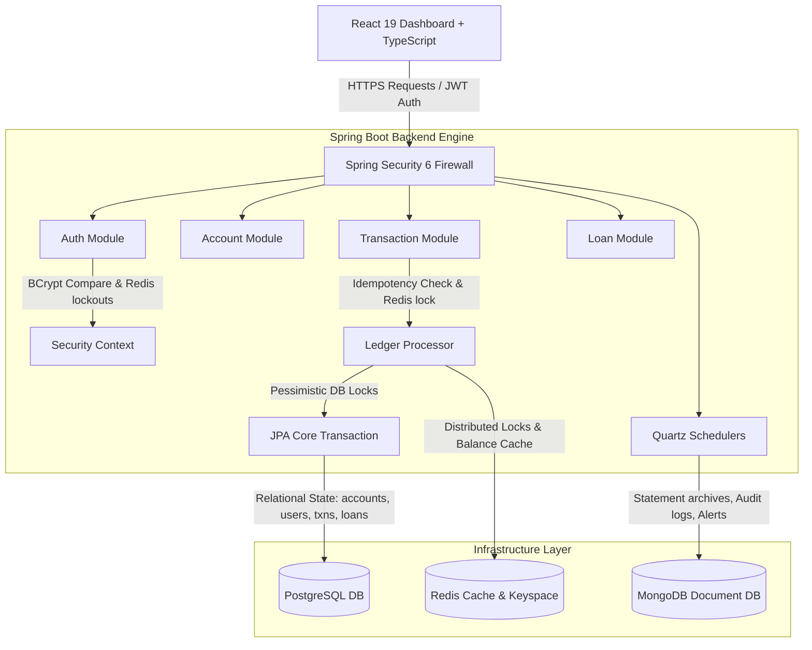
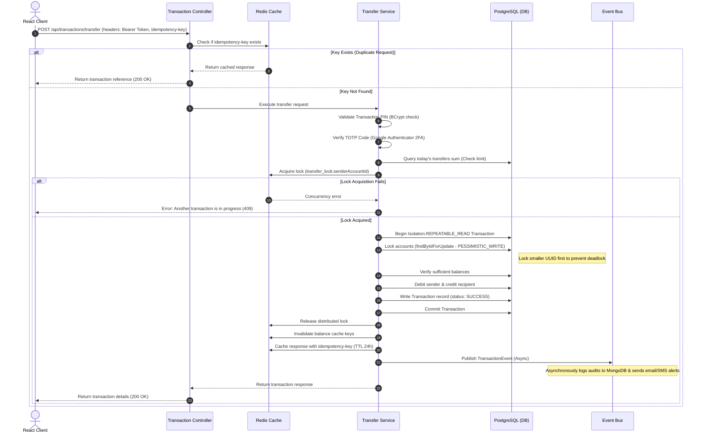

# 🏦 VAULT (Verified Accounts & Unified Ledger Transactions) — Secure Enterprise Digital Banking & Ledger Clearance Engine

> A high-performance, secure core retail banking ledger and transaction clearance system featuring distributed locking, multi-database auditing, automated interest/EMI scheduling, and multi-factor authentication.


---

## 🔗 Live Deployments

- **Frontend App (Live)**: [https://vaultbyritik.vercel.app/](https://vaultbyritik.vercel.app/)

---

## 📸 Screenshots

| Login | Registration |
|:---:|:---:|
|  |  |

| Setup 2FA | Dashboard |
|:---:|:---:|
|  |  |

| Fund Transfer |
|:---:|
|  |

---

## 🏗️ Technical Architecture



---

## 💰 Fund Transfer Critical Flow



---

## ✨ Features

- 🔒 **High-Security Auth & 2FA** — Spring Security 6 with stateless JWT access tokens, rotated refresh tokens, and Google Authenticator TOTP 2FA setup wizard.
- 🔄 **Fund Transfer Ledger Engine** — Safe, high-concurrency fund transfers using Pessimistic Database Locking (`PESSIMISTIC_WRITE`) and ordered locks to prevent deadlocks.
- 🛡️ **Distributed Lock Management** — Prevent double-spending and overdraft race conditions using Redis-based distributed locks.
- ⚡ **Idempotency Shielding** — All state-changing transactions are validated against an API Idempotency Key cached in Redis for 24 hours.
- 📈 **Loan EMI Amortization** — Automated amortized monthly schedule calculators for active personal/retail loans.
- ⏰ **Automated Quartz Schedulers** — Daily interest accrual credits, monthly statement generation, fixed deposit maturity warnings, and loan EMI notifications.
- 📑 **Secure Audit & Statement Logging** — Relational transaction history stored in PostgreSQL, with detailed, append-only logs and statement archives in MongoDB.
- 🔏 **At-Rest Field Encryption** — AES-256-GCM database field encryption for sensitive data (e.g., account numbers, TOTP secrets) using custom JPA attribute converters.
- 🚫 **Account Lockout Policy** — 5 consecutive failed login attempts trigger an automatic 30-minute lockout enforced in Redis.

---

## 🛠️ Tech Stack

### Backend

| Technology | Purpose |
|---|---|
| Java 17 | Core language |
| Spring Boot 3.3.x | Backend framework |
| Spring Security 6 + JWT | Stateless auth, access & refresh token rotation |
| Google Authenticator (TOTP) | Two-factor authentication (2FA) |
| Spring Data JPA + Hibernate | Relational mapping & database interactions |
| PostgreSQL | Primary relational database (ledger, users, loans) |
| MongoDB | Document database (audit logs, statement archives) |
| Redis | Cache, distributed locks, idempotency cache, blacklists |
| Quartz Scheduler | Enterprise scheduling for interest, statements, and alerts |
| Lombok | Boilerplate reduction |
| Docker + Docker Compose | Infrastructure orchestration |

### Frontend

| Technology | Purpose |
|---|---|
| React 19 | UI framework |
| TypeScript 5.x | Type-safe frontend development |
| Vite 5/6 | Build tool and dev server |
| Tailwind CSS | Utility-first styling |
| shadcn/ui + Radix UI | Premium visual UI component primitives |
| React Router DOM | Client-side routing |
| Axios | API calls with JWT request/response interceptors |

---

## ⚙️ Quartz Scheduler Jobs

| Job Name | Cron Expression | Execution Interval | Description |
|---|---|---|---|
| `DailyInterestJob` | `0 0 0 * * ?` | Midnight Daily | Calculates and credits daily interest to active savings accounts. |
| `MonthlyStatementJob` | `0 0 1 1 * ?` | 1:00 AM on 1st of Month | Aggregates credits/debits, calculates opening balances, writes statements to MongoDB, and emails alerts. |
| `FDMaturityAlertJob` | `0 0 9 * * ?` | 9:00 AM Daily | Sends maturity warning emails for Fixed Deposits maturing in exactly 7 days. |
| `LoanEMIReminderJob` | `0 0 8 * * ?` | 8:00 AM Daily | Sends EMI installment reminders 3 days before payment due dates. |
| `OTPCleanupJob` | `0 */5 * * * ?` | Every 5 Minutes | Monitors expired OTP session keyspace in Redis. |
| `InterBankTransferJob` | `0 */30 * * * ?` | Every 30 Minutes | Simulates clearing house clearance for pending interbank transfers. |

---

## 🚀 Local Development Setup

### Prerequisites

- Java 17+
- Node.js 18+
- Docker + Docker Compose

---

### 1. Clone the repository

```bash
git clone https://github.com/ritik-hedau18/VAULT.git
cd VAULT
```

### 2. Start infrastructure

```bash
docker-compose up -d
```

Starts PostgreSQL on `:5432`, Redis on `:6379`, and MongoDB on `:27017`.

### 3. Configure environment variables

```bash
cp .env.example .env
```

Fill in your `.env` or set these variables in your environment:

```env
DB_URL=jdbc:postgresql://localhost:5432/vaultdb
DB_USER=vaultuser
DB_PASSWORD=vaultpassword
MONGO_URI=mongodb://localhost:27017/vault_audit
REDIS_HOST=localhost
REDIS_PORT=6379
JWT_SECRET=404E635266556A586E3272357538782F413F4428472B4B6250645367566B5970
AES_SECRET_KEY=SuperSecretVaultKeyEncryptAtRest12
TWILIO_ACCOUNT_SID=mock_sid
TWILIO_AUTH_TOKEN=mock_token
TWILIO_PHONE_NUMBER=+15017122661
MAIL_HOST=smtp.gmail.com
MAIL_USERNAME=vault.banking@gmail.com
MAIL_PASSWORD=mock_password
```

### 4. Run the backend

```bash
cd backend
mvn spring-boot:run
```

Backend starts at `https://localhost:8080`.
*Swagger API documentation:* `https://localhost:8080/swagger-ui.html`

### 5. Run the frontend

```bash
cd frontend
npm install
npm run dev
```

Frontend starts at `http://localhost:5173`.

---

## 🔌 API Reference

### Auth Endpoints

| Method | Endpoint | Description | Auth Required |
|---|---|---|---|
| POST | `/api/auth/register` | Register a new user | ❌ |
| POST | `/api/auth/login` | Login, returns JWT tokens | ❌ |
| POST | `/api/auth/2fa/setup` | Generate TOTP secret & QR code | ✅ |
| POST | `/api/auth/2fa/verify` | Verify OTP code and enable 2FA | ✅ |
| POST | `/api/auth/refresh` | Refresh access token | ❌ |
| POST | `/api/auth/logout` | Revoke tokens and logout | ✅ |
| GET | `/api/auth/ping` | Health check (ping-pong) | ❌ |

### Account Endpoints

| Method | Endpoint | Description | Auth Required |
|---|---|---|---|
| GET | `/api/accounts/me` | Fetch active user accounts | ✅ |
| POST | `/api/accounts/create` | Open a new savings/checking account | ✅ |

### Transaction Endpoints

| Method | Endpoint | Description | Auth Required |
|---|---|---|---|
| POST | `/api/transactions/deposit` | Deposit funds | ✅ |
| POST | `/api/transactions/withdraw` | Withdraw funds | ✅ |
| POST | `/api/transactions/transfer` | Fund transfer (same-bank/interbank) | ✅ |
| GET | `/api/transactions/history` | List ledger history with filters | ✅ |

### Loan Endpoints

| Method | Endpoint | Description | Auth Required |
|---|---|---|---|
| POST | `/api/loans/apply` | Apply for a retail loan | ✅ |
| GET | `/api/loans/my-loans` | Fetch user's active loans & schedules | ✅ |
| POST | `/api/loans/repay/{id}` | Repay a loan installment | ✅ |

---

## 🔒 Security & Reliability Design

- **At-Rest Field Encryption**: Critical user data (`account_number`, 2FA `totp_secret`) are encrypted prior to database persistence in PostgreSQL using AES-256-GCM.
- **Race Condition Prevention**: Concurrency conflicts during balance edits are resolved via a combination of Redis-based distributed locking (`transfer_lock:{accountId}`) and DB pessimistic write locks (`PESSIMISTIC_WRITE`).
- **Deadlock Mitigation**: Relational DB locks are always acquired in sorted order based on UUID strings, preventing classic deadlock situations under high transactional load.
- **Idempotency Shield**: Every transfer, deposit, or withdrawal pipeline requires a client-provided `idempotency-key` header. Results are cached in Redis for 24 hours to prevent duplicate execution.
- **Account Lockout**: 5 failed login attempts lock the user out for 30 minutes, managed in memory by Redis.

---

## 🗄️ Database Schemas

| Table/Collection | Purpose | Database |
|---|---|---|
| `users` | User credentials, roles, and status | PostgreSQL |
| `accounts` | Bank account numbers, balance, type, ownership | PostgreSQL |
| `transactions` | Relational ledger entries (idempotency reference, amounts) | PostgreSQL |
| `loans` | Active loans, principal, interest, tenure, balance | PostgreSQL |
| `loan_installments` | Amortization schedule dates, principal/interest split | PostgreSQL |
| `audit_logs` | Detailed append-only security logs & transaction trails | MongoDB |
| `statements` | Monthly generated statement snapshots | MongoDB |

---

## 👤 Author

**Ritik Hedau**
Java Full Stack Developer | Spring Boot | Spring AI | React
📍 India

[](https://github.com/ritik-hedau18)

---

## 🔗 Related Projects

| Project | Description |
|---|---|
| [NEXUS](https://github.com/ritik-hedau18/NEXUS) | AI-powered enterprise document workspace platform |
| [TRACE](https://github.com/ritik-hedau18/TRACE-Transaction-Risk-and-Anomaly-Classification-Engine) | Real-time fraud detection system using Spring Boot microservices + Kafka |
| [SRIJAN](https://github.com/ritik-hedau18/SRIJAN) | AI-powered Spring Boot code generator using Groq LLaMA + Spring AI |

---

## 📄 License

This project is open source and available under the [MIT License](LICENSE).
