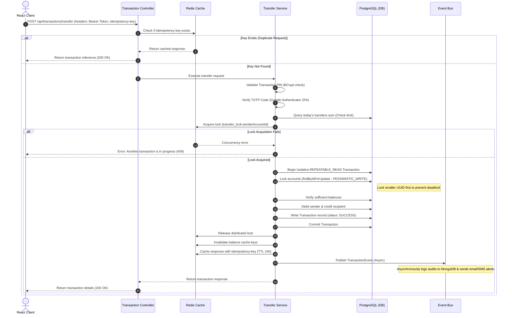

# 🚀 VAULT — Verified Accounts & Unified Ledger Transactions

> **Project Status**: 🛠️ *Under Active Development*

[](https://www.oracle.com/java/)
[](https://spring.io/projects/spring-boot)
[](https://react.dev/)
[](https://www.typescriptlang.org/)
[](https://www.postgresql.org/)
[](https://redis.io/)
[](https://www.mongodb.com/)
[](https://www.docker.com/)

VAULT is a secure, production-style digital banking and ledger clearance engine. It manages core retail banking operations (account management, deposits/withdrawals, same-bank & inter-bank transfers), loan management with monthly EMI amortization schedule computations, automatic daily interest credits, and admin oversight. 

Built with **Java Spring Boot**, **Redis distributed locking**, **MongoDB audits**, **AES-256-GCM database field encryption**, and **Spring Security 6 with short-lived JWTs and 2FA TOTP (Google Authenticator)**.

---

## 🏗️ Technical Architecture

```mermaid
graph TD
    Client[React 19 Dashboard + TypeScript] -->|HTTPS Requests / JWT Auth| Gateway[Spring Security 6 Firewall]
    
    subgraph Spring Boot Backend Engine
        Gateway --> Auth[Auth Module]
        Gateway --> Account[Account Module]
        Gateway --> Transaction[Transaction Module]
        Gateway --> Loan[Loan Module]
        Gateway --> Scheduler[Quartz Schedulers]
        
        Auth -->|BCrypt Compare & Redis lockouts| CustomUserDetails[Security Context]
        Transaction -->|Idempotency Check & Redis lock| TransferService[Ledger Processor]
        TransferService -->|Pessimistic DB Locks| DBWrite[JPA Core Transaction]
    end

    subgraph Infrastructure Layer
        DBWrite -->|Relational State: accounts, users, txns, loans| Postgres[(PostgreSQL DB)]
        TransferService -->|Distributed Locks & Balance Cache| RedisCache[(Redis Cache & Keyspace)]
        Scheduler -->|Statement archives, Audit logs, Alerts| Mongo[(MongoDB Document DB)]
    end
```



---

## 💰 Fund Transfer Critical Flow



---

## 🔐 Security Features

1. **AES-256-GCM Encryption**: Critical user data like `account_number` and 2FA `totp_secret` are encrypted before writing to PostgreSQL using a static JPA Attribute Converter. The IV is randomly generated per encryption (12 bytes) and prepended to ciphertext.
2. **Distributed Locks**: To prevent concurrent overdrafts and double-spend race conditions, a Redis lock (`transfer_lock:{accountId}`) is held during transfer pipelines.
3. **Deadlock Prevention**: Database write locks (`PESSIMISTIC_WRITE`) are acquired in sorted order based on UUID strings.
4. **Idempotency Shield**: All transfers, deposits, and withdrawals require an `idempotency-key` header. Results are cached in Redis for 24 hours.
5. **Account Lockout**: Failed login attempts trigger an incrementing counter in Redis (`login_attempts:{email}`). 5 consecutive failures lock the account for 30 minutes.
6. **2FA Setup Wizard**: 2FA secrets are cached temporarily in Redis (`otp:{userId}`) during the setup phase. The feature is only enabled in PostgreSQL once the user successfully verifies a code.
7. **Stateless JWT Security**: Spring Security 6 handles access tokens (15-min TTL) and rotated refresh tokens (7-day TTL). Revoked tokens are blacklisted in Redis.

---

## ⚙️ Quartz Scheduler Jobs

| Job Name | Cron Expression | Execution Interval | Description |
|---|---|---|---|
| `DailyInterestJob` | `0 0 0 * * ?` | Midnight Daily | Calculates and credits daily interest to active savings accounts. |
| `MonthlyStatementJob` | `0 0 1 1 * ?` | 1:00 AM on 1st of Month | Aggregates credits/debits, calculates opening balances, writes statements to MongoDB, and emails alerts. |
| `FDMaturityAlertJob` | `0 0 9 * * ?` | 9:00 AM Daily | Sends maturity warning emails for Fixed Deposits maturing in exactly 7 days. |
| `LoanEMIReminderJob` | `0 0 8 * * ?` | 8:00 AM Daily | Sends EMI installment reminders 3 days before payment due dates. |
| `OTPCleanupJob` | `0 */5 * * * ?` | Every 5 Minutes | Monitores expired OTP session keyspace in Redis. |
| `InterBankTransferJob` | `0 */30 * * * ?` | Every 30 Minutes | Simulates clearing house clearance for pending interbank transfers. |

---

## 📁 Environment Variables

Create a `.env` file in the root directory before running the containers:

| Variable Name | Example Value | Description |
|---|---|---|
| `DB_URL` | `jdbc:postgresql://localhost:5432/vaultdb` | Primary PostgreSQL JDBC URL |
| `DB_USER` | `vaultuser` | PostgreSQL Database Username |
| `DB_PASSWORD` | `vaultpassword` | PostgreSQL Database Password |
| `MONGO_URI` | `mongodb://localhost:27017/vault_audit` | MongoDB connection URI |
| `REDIS_HOST` | `localhost` | Redis server hostname |
| `REDIS_PORT` | `6379` | Redis server port number |
| `JWT_SECRET` | `404E635266556...6D5367566` | HMAC-SHA256 Secret (At least 32 bytes) |
| `AES_SECRET_KEY` | `SuperSecretVaultKeyEncryptAtRest12` | AES-256 cipher secret key (16, 24, or 32 characters) |
| `TWILIO_ACCOUNT_SID` | `AC00000000000000000000000` | Twilio Account SID (use mock values for fallback) |
| `TWILIO_AUTH_TOKEN` | `your_twilio_token` | Twilio API Auth Token |
| `TWILIO_PHONE_NUMBER` | `+15017122661` | Configured Twilio SMS phone number |
| `MAIL_HOST` | `smtp.gmail.com` | Gmail SMTP Server address |
| `MAIL_USERNAME` | `vault.banking@gmail.com` | Sender Gmail username |
| `MAIL_PASSWORD` | `your_app_specific_password` | App-specific Google account password |

---

## 🚀 Local Development Setup

### Prerequisite Databases (Docker Compose)
1. Run the database containers:
   ```bash
   docker-compose up -d
   ```

### Backend Startup (Spring Boot)
1. Import project into your IDE or navigate to the backend directory:
   ```bash
   cd backend
   ```
2. Build the project and run the tests:
   ```bash
   mvn clean test
   ```
3. Run the application:
   ```bash
   mvn spring-boot:run
   ```
   *The Swagger API documentation will be available at:* `https://localhost:8080/swagger-ui.html`

### Frontend Startup (React + Vite)
1. Navigate to the frontend directory:
   ```bash
   cd frontend
   ```
2. Install npm dependencies:
   ```bash
   npm install
   ```
3. Start the development server:
   ```bash
   npm run dev
   ```
   *The React panel will be available at:* `http://localhost:5173`

---

## 🌐 Selected API Examples

### 1. Perform Fund Transfer
```bash
curl -X POST https://localhost:8080/api/transactions/transfer \
  -H "Authorization: Bearer <JWT_ACCESS_TOKEN>" \
  -H "idempotency-key: a5436c84-9de2-4c28-98e3-ea62df7bc8e2" \
  -H "Content-Type: application/json" \
  -d '{
    "fromAccountId": "85ef0a59-b1d5-4ad9-a78b-d53bf540cc8c",
    "toAccountNumber": "100088882222",
    "amount": 2500.00,
    "transactionPin": "1234",
    "totpCode": "847291",
    "interBank": false,
    "description": "Invoice #4928"
  }'
```

### 2. Configure 2FA (Setup)
```bash
curl -X POST https://localhost:8080/api/auth/2fa/setup \
  -H "Authorization: Bearer <JWT_ACCESS_TOKEN>"
```

### 3. Apply for Retail Loan
```bash
curl -X POST https://localhost:8080/api/loans/apply \
  -H "Authorization: Bearer <JWT_ACCESS_TOKEN>" \
  -H "Content-Type: application/json" \
  -d '{
    "accountId": "85ef0a59-b1d5-4ad9-a78b-d53bf540cc8c",
    "loanType": "CAR",
    "principal": 350000.00,
    "interestRate": 8.75,
    "tenureMonths": 36
  }'
```

---

## 🔗 Fintech Ecosystem Context
VAULT is designed to represent the core transactional banking node within our digital finance ecosystem. It acts as the unified ledger of record for retail accounts, which integrates natively with upstream clearing nodes (like **TRACE** - Transaction Routing & Auto-Clearing Engine) to orchestrate multi-entity payments, audit verification trails, and bulk ledger settlements.
